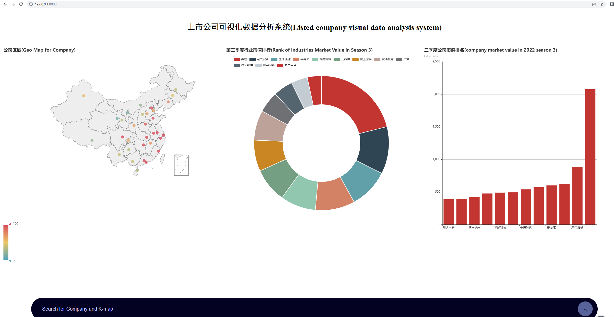
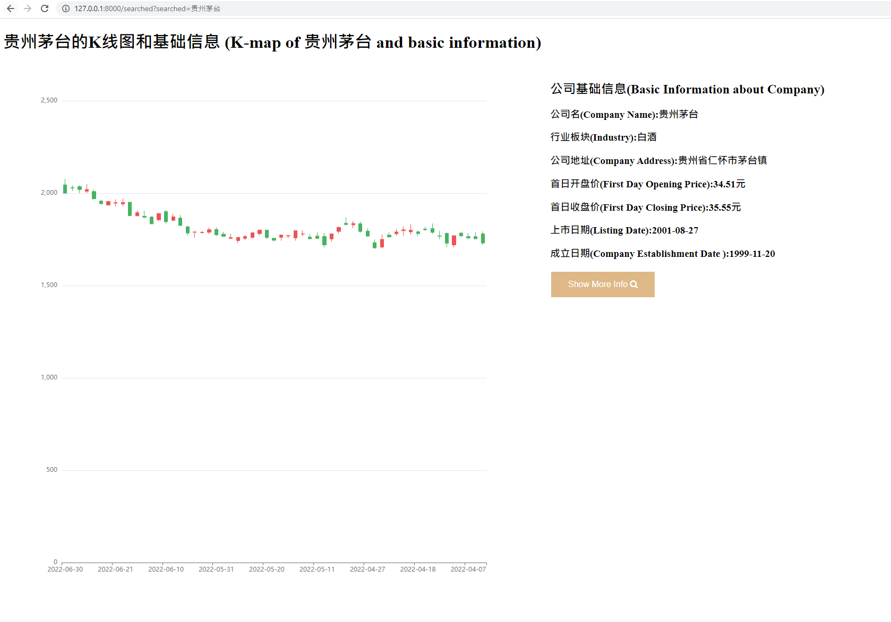

# django-site
This project visualize data of chinese stock information, which contains 4800+ chinese stocks. This project focuses more on back-end interactions by using Django, SQL, and vanilla JS.

***Reference: web scrapping data from <http://quotes.money.163.com/stock/>***

### Home Page

The home page displays the general information about the whole of chinese stock system. Different data are shown by different charts, such as map chart, pie chart and bar chart.

### Detail Page

The detail page displays the detail information about specific company